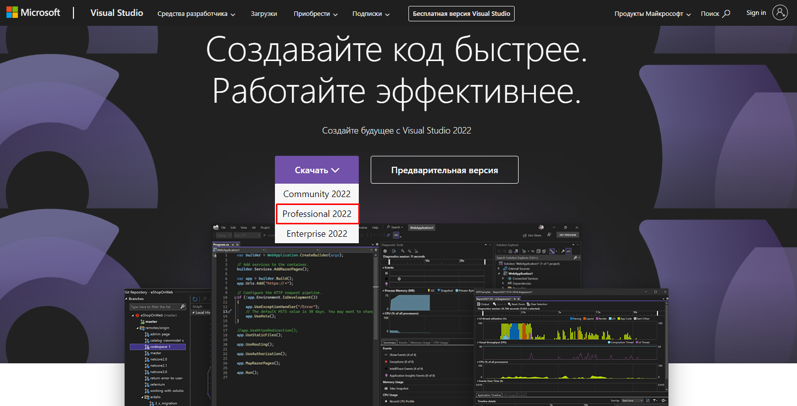
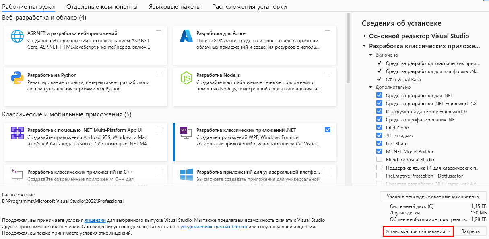

<table style="width: 100%;">
    <tr>
        <td style="width: 20%;">
            <a href="./t1pract1.md">Назад</a>
        </td>
    <tr>
</table>

# Установка Visual Studio

Чтобы облегчить написание, а также тестирование и отладку программного кода нередко используют специальные среды разработки, в частности, Visual Studio. Рассмотрим создание приложений на C# с помощью бесплатной и полнофункциональной среды Visual Studio Community 2022, которую можно загрузить по следующему адресу: 
[Visual Studio 2022](https://visualstudio.microsoft.com/ru/vs/)

После загрузки запустим программу установщика. В открывшемся окне нам будет предложено выбрать те компоненты, которые мы хотим установить вместе Visual Studio. Стоит отметить, что Visual Studio - очень функциональная среда разработки и позволяет разрабатывать приложения с помощью множества языков и платформ. В нашем случае нам будет интересовать прежде всего C# и .NET.

Чтобы добавить в Visual Studio поддержку проектов для C# и .NET 7, в программе установки среди рабочих нагрузок можно выбираем пункт **Разработка классических приложений .NET** и после этого нажимаем на кнопку установить

Дождавшись окончания загрузки и установки Visual Studio на ваш компьютер будут установлены все необходимые инструменты для разработки программ.

<table style="width: 100%;">
    <tr>
        <td style="width: 20%;">
            <a href="./t1pract1.md">Назад</a>
        </td>
    <tr>
</table>