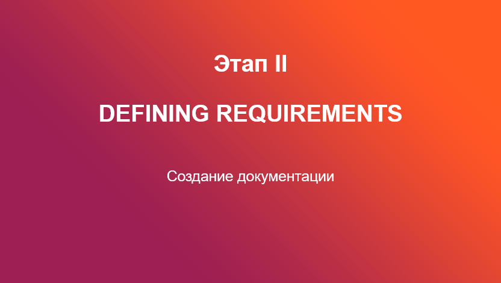
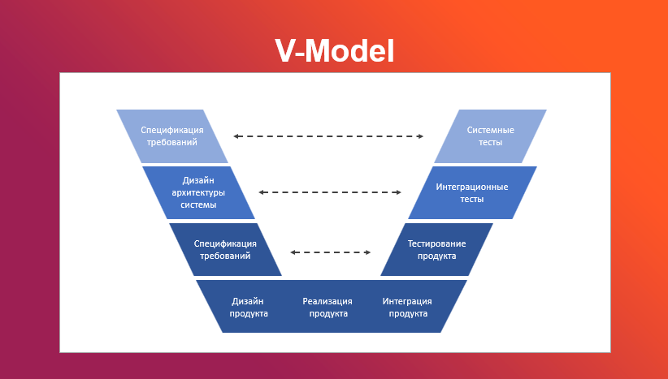
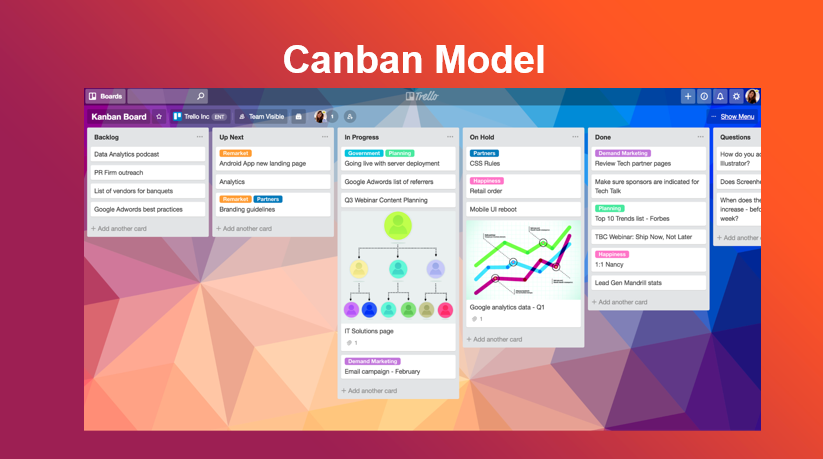

<table style="width: 100%;">
    <tr>
        <td style="width: 40%;">
            <a href="./t1l1.md">Жизненный Цикл ПО</a>
        </td>
        <td style="width: 20%;">
            <a href="../../README.md">Содержание</a>
        </td>
        <td style="width: 40%;">
            <a href="../t2/t2l1.md">Следующая тема</a>
        </td>
    <tr>
</table>

# [Презентация] Цикл Жизни ПО. Понятия, этапы и модели разработки ПО. 

<table style="width: 100%;">
    <tr>
        <td style="width: 40%;">
            <a href="./t1l1.md">Жизненный Цикл ПО</a>
        </td>
        <td style="width: 20%;">
            <a href="../../README.md">Содержание</a>
        </td>
        <td style="width: 40%;">
            <a href="../t2/t2l1.md">Следующая тема</a>
        </td>
    <tr>
</table>