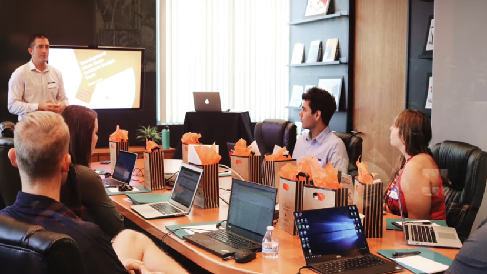
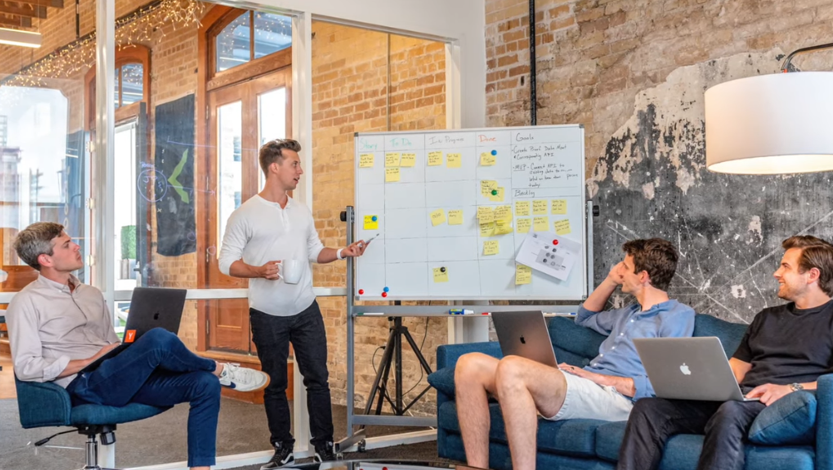
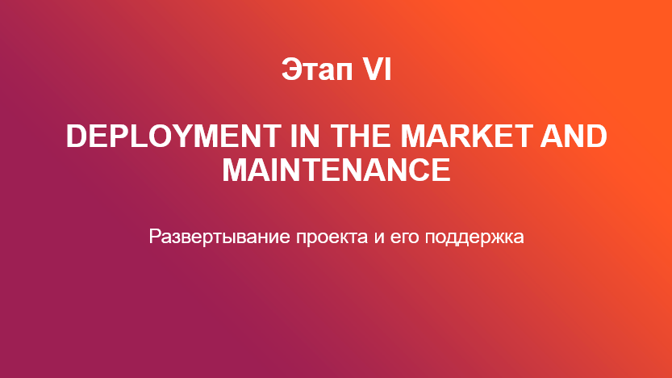
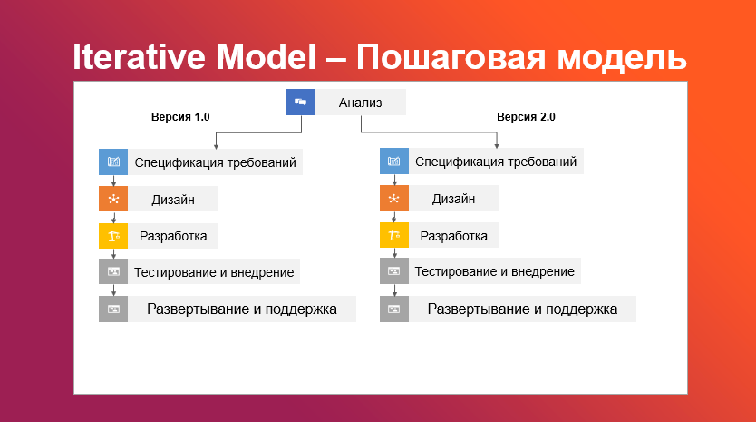
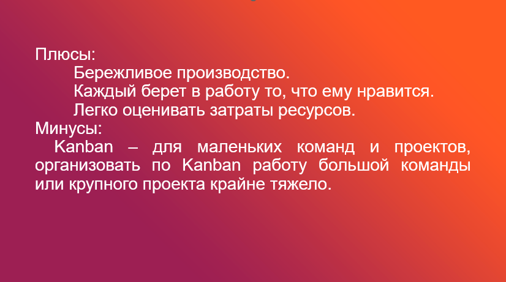

<table style="width: 100%;">
<tr><td style="width: 40%;">
<a href="./t1l1.md">Жизненный Цикл ПО</a></td>
<td style="width: 20%;">
<a href="../../README.md">Содержание</a></td>
<td style="width: 40%;">
<a href="../t2/t2l1.md">Следующая тема</a></td>
<tr></table>

# [Презентация] Цикл Жизни ПО. Понятия, этапы и модели разработки ПО. 

<table style="width: 100%;">
<tr><td style="width: 40%;">
<a href="./t1l1.md">Жизненный Цикл ПО</a></td>
<td style="width: 20%;">
<a href="../../README.md">Содержание</a></td>
<td style="width: 40%;">
<a href="../t2/t2l1.md">Следующая тема</a></td>
<tr></table>